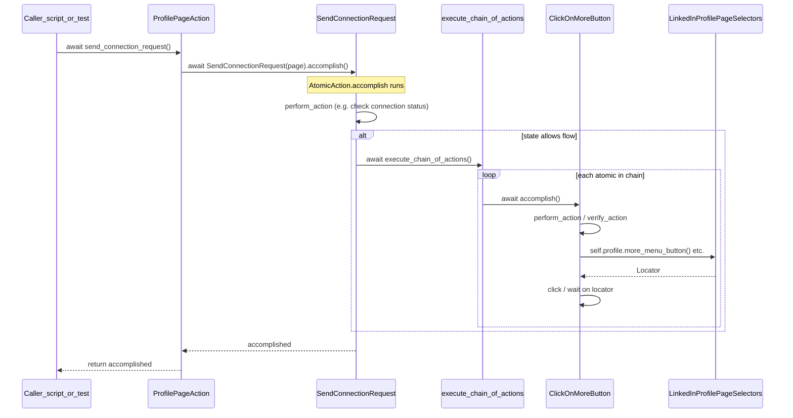
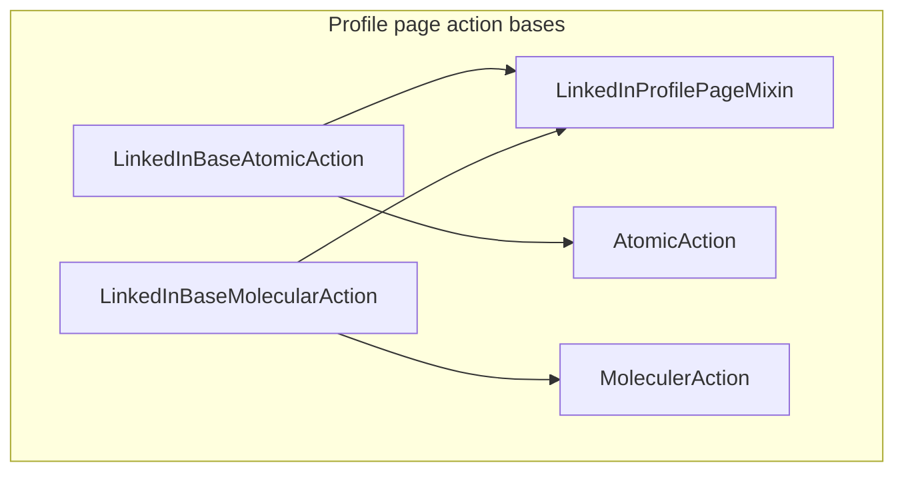

# Core architecture: actions, selectors, and page packages

This guide explains how **selectors** (where on the page) and **actions** (what to do) work together, why **mixins** and `LinkedInBaseAtomicAction` / `LinkedInBaseMolecularAction` exist, and how to add a **new page** to this repo. It complements the high-level layout in [architecture.md](architecture.md).

---

## Table of contents

1. [Two tracks: selectors vs actions](#1-two-tracks-selectors-vs-actions)
2. [Core action classes](#2-core-action-classes)
3. [How a user flow runs end-to-end](#3-how-a-user-flow-runs-end-to-end)
4. [Page mixin and base action classes (MRO)](#4-page-mixin-and-base-action-classes-mro)
5. [Selector model and resolver](#5-selector-model-and-resolver)
6. [Checklist: add a new page](#6-checklist-add-a-new-page)
7. [Pitfalls and operations notes](#7-pitfalls-and-operations-notes)
8. [See also](#8-see-also)

---

## 1. Two tracks: selectors vs actions

| Track | Answers | Lives in | Does **not** do |
|--------|---------|----------|------------------|
| **Selectors** | “Which DOM nodes?” Keys, XPath/CSS strings, parent scoping, fallbacks. | `page/<page>/selectors/` + `core/models.py`, `core/selector_resolver.py` | Click, type, or assert; they only produce Playwright **locators**. |
| **Actions** | “What steps in what order?” Clicks, waits, chains, business flows. | `page/<page>/actions/` (or `action/` in some folders), `core/actions.py` | Store long XPath strings; they **call** the resolver (`self.profile.connect_button()`, etc.). |

**Rule of thumb:** registry + resolver = **data and lookup**. Atomic / molecular / page = **behavior**.

Example (profile): an atomic action uses the resolver, then Playwright:

```text
await self.profile.connect_button().click()
```

See `page/profile_page/actions/atomic_action.py` (`ClickOnConnectButton` and siblings).

---

## 2. Core action classes

Implementation: [`core/actions.py`](core/actions.py).

### AtomicAction

- **One** user-visible step split into **do** and **check**.
- Subclasses implement:
  - `async def perform_action(self) -> None`
  - `async def verify_action(self) -> bool`
- **`await action.accomplish()`** runs `perform_action`, then `verify_action`, sets **`action.accomplished`**. Exceptions are caught, logged with traceback, and `accomplished` is set to `False`.

Callers should use **`await …accomplish()`** and then read **`action.accomplished`**, not assume success without checking.

### MoleculerAction (extends AtomicAction)

- Holds **`chain_of_actions`**: a list of **`AtomicAction`** instances.
- **`execute_chain_of_actions()`** loops: for each child, **`await child.accomplish()`**; if any child fails, returns `False`; between steps calls **`human_wait`** from `core/human_behavior.py` (configurable `DelayConfig`).
- Default **`perform_action`** / **`verify_action`** wire the chain result into `_accomplished`.

Subclasses often **override `perform_action`** to branch on page state (e.g. only run the chain if “not connected”) before calling `execute_chain_of_actions()`. Example: `SendConnectionRequest` in `page/profile_page/actions/molecular_action.py`.

### PageAction (ABC)

- Holds **`self.page`** (Playwright `Page`).
- Subclasses implement **`is_valid_page(self) -> bool`**.
- **Public API** for tests and orchestrators: small methods that construct molecular or atomic actions, **`await action.accomplish()`**, return or log based on **`accomplished`**.

Example: [`page/profile_page/actions/page_action.py`](page/profile_page/actions/page_action.py) (`ProfilePageAction`).

---

## 3. How a user flow runs end-to-end

High-level sequence (typical “send connection” style flow):



- **PageAction** does not implement `perform_action` on the molecule; it **constructs** the molecular class and calls **`accomplish()`** on it.
- **Molecular** may skip the chain entirely if state says “already connected” (then read that class’s `perform_action` carefully).
- **Atomic** classes talk to **`self.profile`** (or your page’s resolver attribute) for locators only.

---

## 4. Page mixin and base action classes (MRO)

### Why a mixin?

Every atomic step on the same page needs:

- The same **resolver** instance (or equivalent), e.g. `LinkedInProfilePageSelectors(self.page)`.
- The same **helpers**: wait for page shell, read “connection” or “follow” state, wait for a dialog.

Duplicating that in dozens of `ClickOn…` classes would be error-prone. The **page mixin** centralizes:

- **`__init__(self, page, **kwargs)`** calling `super().__init__(page, **kwargs)` and attaching **`self.profile = LinkedInProfilePageSelectors(page)`** (profile example: [`page/profile_page/actions/base_action.py`](page/profile_page/actions/base_action.py)).
- Helpers like **`_wait_for_page_to_load`**, **`_get_connection_status`**, **`_wait_for_dialog`**.

The mixin is **not** a Playwright concept; it is plain Python **cooperative multiple inheritance**.

### Why `LinkedInBaseAtomicAction` and `LinkedInBaseMolecularAction`?

They lock in **inheritance order** (MRO):

```text
LinkedInBaseAtomicAction(LinkedInProfilePageMixin, AtomicAction)
LinkedInBaseMolecularAction(LinkedInProfilePageMixin, MoleculerAction)
```

**Mixin first**, then **core base**. That way:

1. `LinkedInProfilePageMixin.__init__` runs and can call **`super().__init__(page, **kwargs)`**, which continues to `AtomicAction.__init__` / `MoleculerAction.__init__`.
2. Every concrete atomic/molecular on that page subclasses these bases and automatically gets **`self.profile`** and helpers.



Concrete atomics (e.g. `ClickOnMoreButton`) inherit **`LinkedInBaseAtomicAction`** only; they do not repeat the mixin + `AtomicAction` pair.

### PageAction and the mixin

`ProfilePageAction` is declared as:

```text
class ProfilePageAction(LinkedInProfilePageMixin, PageAction):
```

So the public orchestrator also has **`self.profile`** and **`_wait_for_page_to_load`**, consistent with atomics.

### Search page variant

[`page/search_page/action/base_action.py`](page/search_page/action/base_action.py) uses the same pattern with **`LinkedInSearchPageMixin`** and **`self.search_result = LinkedInSearchPageSelectors(page)`**.

**Naming consistency:** profile uses the folder **`actions/`**; search currently uses **`action/`**. For new pages, prefer **`actions/`** to match profile and this documentation.

---

## 5. Selector model and resolver

### SelectorEntry ([`core/models.py`](core/models.py))

Each entry has:

- **`key`**: enum member for that control or region.
- **`local_selectors`**: list of strings; resolved under **`get(parent)`** when `parent` is set, otherwise under the full **`page`**.
- **`global_selectors`**: list of strings; always resolved from **`page`** (parent is ignored for this list).
- **`parent`**: optional enum key pointing at another registry entry (must be registered **before** the child).

At least one of **`local_selectors`** or **`global_selectors`** must be non-empty (model validator).

When both lists are non-empty, the resolver builds **local branch OR global branch** (locals first), mirroring “prefer scoped, then page-wide fallback” semantics. Details: [`core/selector_resolver.py`](core/selector_resolver.py).

### SelectorRegistry

- **`register(entry)`** enforces unique keys and **parent-before-child** registration order.

### Resolver subclass per page

- Subclass **`SelectorResolver`**, pass **`(page, registry)`** in `__init__`.
- Add **typed methods** (`connect_button()`, `dialog()`, …) that delegate to **`self.get(YourPageKey.CONNECT_BUTTON)`** for readability and safe refactors.

Profile reference: [`page/profile_page/selectors/selector_resolver.py`](page/profile_page/selectors/selector_resolver.py).

---

## 6. Checklist: add a new page

Use `page/<new_page>/` as the template name below.

1. **`selectors/selector_keys.py`**  
   Define an enum (e.g. `NewPageKey`) with one member per logical region or control you need from actions.

2. **`selectors/selector_registry.py`**  
   - Instantiate **`SelectorRegistry[NewPageKey]`**.  
   - **`register(SelectorEntry(...))`** for each key.  
   - Register **parents before children**.  
   - Fill **`local_selectors`**, **`global_selectors`**, and **`parent`** to match how Playwright should scope each locator.

3. **`selectors/selector_resolver.py`**  
   - Subclass **`SelectorResolver`**.  
   - `__init__(self, page): super().__init__(page, YOUR_REGISTRY_CONSTANT)`.  
   - Add accessor methods for every key you use from actions (or use **`get(NewPageKey.X)`** only).

4. **`actions/base_action.py`** (name may be `action/` in legacy folders)  
   - **Mixin**: `__init__(self, page, **kwargs)` → `super().__init__(page, **kwargs)` → **`self.<name> = YourResolver(page)`**.  
   - Add shared async helpers (wait for shell, read state, etc.).  
   - Define **`YourBaseAtomicAction(Mixin, AtomicAction)`** and **`YourBaseMolecularAction(Mixin, MoleculerAction)`** with **mixin first**.

5. **`actions/atomic_action.py`**  
   - One small class per step, subclass **`YourBaseAtomicAction`**.  
   - Implement **`perform_action`** / **`verify_action`** using **`self.<resolver_attr>`** only (no raw XPath in actions if avoidable).

6. **`actions/molecular_action.py`**  
   - Subclass **`YourBaseMolecularAction`**.  
   - Set **`chain_of_actions`** in `__init__`.  
   - Override **`perform_action`** when the chain must be **gated** on page state; call **`await self.execute_chain_of_actions()`** when appropriate.

7. **`actions/page_action.py`**  
   - **`class YourPageAction(Mixin, PageAction):`**.  
   - Validate URL or page type in **`__init__`**.  
   - Implement **`is_valid_page`**.  
   - Public methods: build molecular/atomic, **`await x.accomplish()`**, check **`x.accomplished`**, log.

8. **`actions/__init__.py`**  
   - Export the main **`YourPageAction`** (and optionally key molecular classes if tests need them).

9. **Scripts / tests**  
   - Navigate with Playwright, then **`YourPageAction(page)`** and call public methods.

Optional: small **`profile_state.py`-style** module for enums used only by actions on that page.

---

## 7. Pitfalls and operations notes

### Strict mode and multiple matches

Playwright **strict** APIs (`click`, `is_visible`, etc.) require a locator to resolve to **exactly one** element. If your registry builds a union that matches **two** nodes (common with broad `//a[...]` fallbacks), you get a **strict mode violation**. Fix by tightening selectors, scoping under a stable parent, or intentionally using **`.first`** / **`.nth(n)`** on the resolver side when you truly mean “pick one.”

### Logging and `logger.debug`

`core/actions.py` logs chain steps at **DEBUG**. You only see them if:

- The effective log level for the **`core.actions`** logger (and propagation to handlers) is **DEBUG**, and  
- The code path actually enters **`execute_chain_of_actions`** (molecular `perform_action` may skip the chain when state does not require it).

### Imports and Playwright

Importing **`core`** may execute [`core/__init__.py`](core/__init__.py), which pulls in modules that depend on **Playwright**. Run scripts with a virtualenv where Playwright is installed (see project conventions).

---

## 8. See also

- Code references used throughout this doc:
  - [`core/actions.py`](core/actions.py)
  - [`core/models.py`](core/models.py)
  - [`core/selector_resolver.py`](core/selector_resolver.py)
  - [`page/profile_page/actions/base_action.py`](page/profile_page/actions/base_action.py)
  - [`page/profile_page/actions/page_action.py`](page/profile_page/actions/page_action.py)
  - [`page/profile_page/actions/molecular_action.py`](page/profile_page/actions/molecular_action.py)
  - [`page/profile_page/actions/atomic_action.py`](page/profile_page/actions/atomic_action.py)
